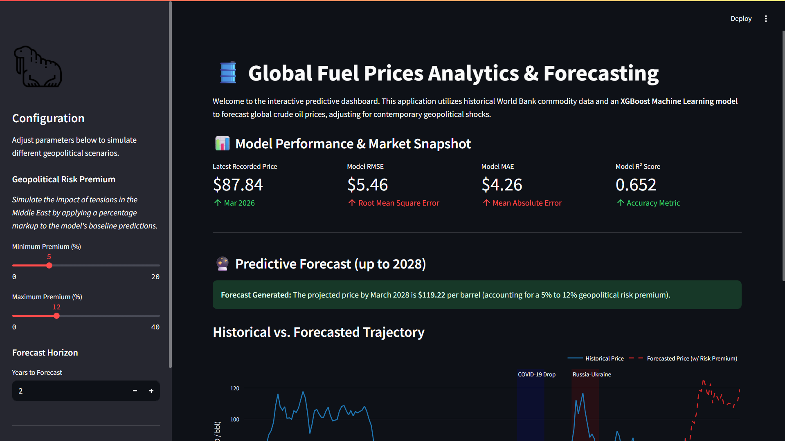
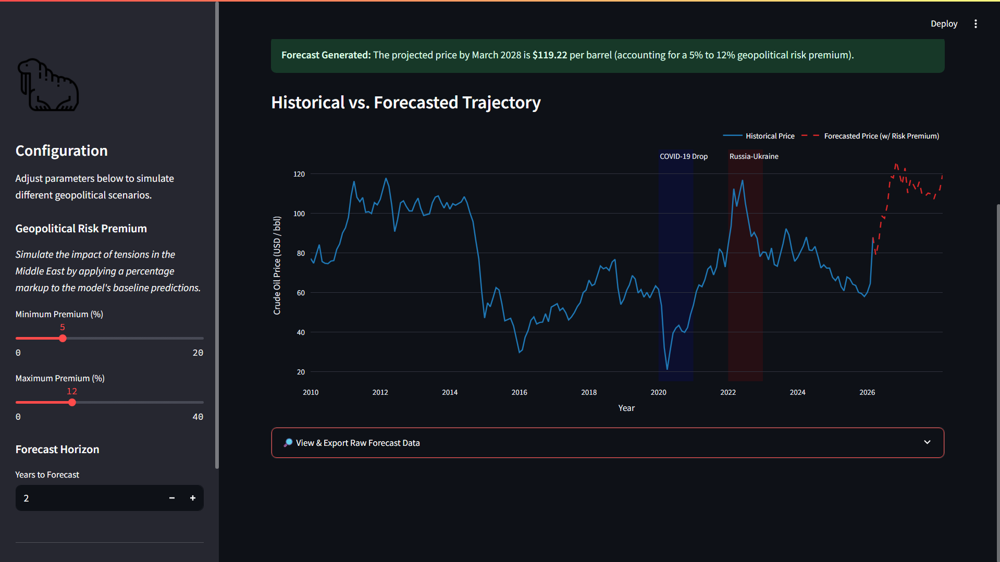

<div align="center">

# 🛢️ GLOBAL FUEL PRICES ANALYTICS
### 🌍 *Interactive Forecasting & Machine Learning Dashboard* 🌍

**An end-to-end ML pipeline predicting petroleum price trajectories through 2026, accounting for macroeconomic shocks and geopolitical risk premiums.**

<br>


<br>





</div>

---


## 📑 Table of Contents

- [Overview](#-overview)
- [Key Features](#-key-features)
- [Technology Stack](#️-technology-stack)
- [Getting Started](#-getting-started)
- [Project Structure](#-project-structure)
- [Key Insights](#-key-insights--2026-outlook)
- [The Team](#-the-team)

## 📖 Overview

The global fuel market is highly sensitive to geopolitical factors. Recently, shifting geological and geopolitical landscapes—including supply chain instabilities and regional tensions in the Middle East—have heavily impacted the market.

This project houses both a comprehensive Data Science Pipeline (Jupyter Notebook) and a Fully Fledged Web Application (Streamlit). It analyzes historical petroleum price trends over the last five decades (1970–present) and utilizes state-of-the-art predictive modeling to forecast future prices. By factoring in historical shocks and allowing users to dynamically adjust modern-day "risk premiums," this project provides actionable, data-driven insights into the future of global energy economics.

## ✨ Key Features

🖥️ Interactive Web Dashboard: A beautiful, responsive UI built with Streamlit that allows users to explore data and model predictions in real-time.

🌍 Dynamic Geopolitical Risk Simulator: Interactive sidebar sliders allow users to simulate different global scenarios by applying percentage markups to the model's baseline predictions.

🤖 XGBoost Forecasting Engine: Utilizes an XGBRegressor model, specifically chosen for its superior ability to handle the non-linear, shock-prone nature of commodity pricing.

📊 Interactive Plotly Visualizations: Hover, zoom, and explore historical vs. forecasted trajectories, complete with background shading for major historical events (e.g., 2008 Financial Crisis, COVID-19, Russia-Ukraine).

🧠 Advanced Feature Engineering: Implementation of time-series specific features, including temporal variables, lagged price indicators, and moving averages to capture market momentum.

## 🛠️ Technology Stack

| Category | Tools & Libraries |
| :--- | :--- |
| **Language** | Python 3 |
| **Web Framework** | Streamlit |
| **Machine Learning** | XGBoost, Scikit-Learn |
| **Data Manipulation** | Pandas, NumPy |
| **Data Visualization** | Plotly, Matplotlib, Seaborn |

🚀 Getting Started

Prerequisites

Ensure you have Python installed on your system. The core dataset (fuel_prices_1970_2026.csv) must be located in the root directory.

Installation & Execution

1. Clone the repository:

git clone [https://github.com/Arsenicwatts/Global-Fuel-Analysis.git](https://github.com/Arsenicwatts/Global-Fuel-Analysis.git)
cd Global-Fuel-Analysis


2. Install required dependencies:

pip install streamlit pandas numpy xgboost scikit-learn plotly


3. Launch the Streamlit App:

streamlit run app.py


The app will automatically open in your default web browser at http://localhost:8501.

## 📂 Project Structure

```text
📁 Global-Fuel-Analysis
│
├── 📁 images                                          # Folder containing project screenshots
│   ├── 🖼️ app_preview.png                             
│   └── 🖼️ historical_analysis.png                     
├── 📄 app.py                                          # Main Streamlit web application
├── 📄 global-fuel-prices-analysis-2026-forecasting.ipynb  # In-depth EDA & Model Training Notebook
├── 📄 fuel_prices_1970_2026.csv                       # Historical World Bank commodity dataset
└── 📄 README.md                                       # Project documentation


💡 Key Insights & 2026 Outlook

Market Forecast: The machine learning model, augmented by our geopolitical tension factor, strongly indicates that as long as instability remains within critical oil-producing regions, global supply chains will price in a continuous "Risk Premium." The forecast anticipates heavily fluctuating prices, potentially surpassing $90–$100 per barrel during acute macro-economic or geopolitical flare-ups in the approach to 2026.

👨‍💻 The Team

This project was developed as an academic collaborative effort.

  Role                                          Name

👑 Team Leader                               Sagun Yadav

👤 Member                                    Atharva Chauhan

👤 Member                                    Dhyey Patel

👤 Member                                    Prasang Verma

👤 Member                                    Darshan Desale
